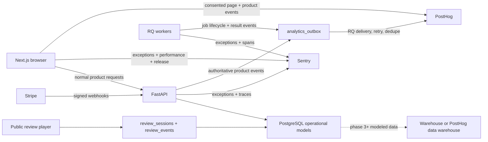

# Editube Product Analytics, Funnel, Subscription, and Reliability Plan

**Status:** repository implementation complete for the analytics foundation and core product journeys; production rollout gates remain
**Prepared:** 2026-08-27
**Implementation audited:** 2026-08-29
**Scope:** Editube marketing site, authentication, onboarding, paid conversion, authenticated product, public review/delivery surfaces, subscription lifecycle, frontend/API/worker reliability, and internal decision dashboards
**Primary audience:** product, engineering, growth, support, and operations

The executable implementation is tracked in [the acceptance matrix](./product-analytics-acceptance-matrix.md). “Implemented in the repository” is not the same as “proven in production”: managed PostHog/Sentry resources are applied, but their staging/production isolation still requires verification, replay requires a privacy red-team, and criteria that require live traffic or human operating reviews cannot be manufactured by code.

---

## 0. Executive decision

Editube should use four connected sources, with one owner for each kind of truth:

| Concern | Source of truth | Purpose |
|---|---|---|
| Visitor and product behavior | PostHog | Page journeys, event funnels, feature adoption, cohorts, retention, session replay, clickmaps, scrollmaps, rage/dead clicks, surveys |
| Bugs and performance | Sentry | Next.js, browser, FastAPI, RQ worker, release, trace, exception, and performance monitoring |
| Subscription state and revenue | Stripe webhooks mirrored into PostgreSQL | Checkout, trials, plan changes, invoices, payment failures, cancellation requests, effective churn, and cancellation reasons |
| Review-video engagement | Existing `review_sessions` and `review_events` tables | Watch time, completion, seeks, rewatch hotspots, comments, sign-offs, and video-specific heatmaps |

Do not install GA, Clarity, Mixpanel, Amplitude, PostHog, and a home-grown event system together. That creates conflicting user counts, duplicate replay, multiple consent obligations, and no trusted answer. Use PostHog for product behavior, Sentry for engineering failures, Stripe for billing truth, and PostgreSQL for Editube-specific operational state.

Do not build a custom internal analytics dashboard first. PostHog and Sentry already provide the exploration surfaces needed to validate the instrumentation. A custom Editube admin dashboard should only be considered after 4–8 weeks of stable data and only for recurring decisions that the provider dashboards cannot serve.

### The hard truth about “why”

Behavioral analytics can prove **where** people stopped, what they did before stopping, and whether an error or slow operation was present. It cannot prove what a person was thinking. “Why” requires triangulation:

1. funnel and cohort data;
2. privacy-safe session replay;
3. correlated error/performance evidence;
4. cancellation and abandonment reason collection;
5. support/community feedback and targeted user interviews.

Any dashboard that labels an inferred reason as fact is lying. The product must distinguish `reported_reason`, `observed_friction`, and `inferred_likely_cause`.

---

## 1. Ground truth found in the current app

This plan is based on the running app at `http://localhost:3002` and the current Next.js/FastAPI code, not on a generic SaaS template.

### 1.1 What already exists

- The frontend has a minimal event shim at `editube-frontend/lib/analytics/events.ts`. It emits an `editube:track` browser event and forwards to `window.plausible` or `window.dataLayer` only if another script created them.
- No provider is initialized in `editube-frontend/app/layout.tsx`; no PostHog, Plausible, Google Tag Manager, or equivalent package is installed. In the current app, most `trackEvent(...)` calls therefore leave no durable analytics record.
- Only a few marketing/onboarding actions are instrumented: pricing CTA clicks, plan selection, billing interval toggles, checkout start/failure/return, and free-onboarding completion.
- `editube/app/api/routes/analytics.py` is entirely commented out. Its Pydantic models are counters rather than an event stream and should not be revived as designed.
- Public review links already have meaningful analytics. `ReviewSession` stores views, watch time, furthest position, completion, and identity metadata; `ReviewEvent` stores play, pause, seek, progress, end, comment, and security-related activity. The link analytics endpoint produces completion, rewatch hotspots, scene groups, and sign-offs.
- Stripe handling is materially stronger than the behavioral analytics. Checkout and webhook processing are idempotent and subscription history is mirrored into `subscriptions`.
- The subscription mirror does not persist Stripe cancellation feedback/comment, cancellation request time, MRR components, discount, currency, or involuntary-versus-voluntary churn classification.
- Frontend failures are largely `console.error(...)`; there is no `error.tsx`, `global-error.tsx`, application error boundary, or production browser error tracker.
- Backend and worker failures use standard logging. There is no release-linked exception aggregation, request correlation, trace propagation, or user-impact calculation.
- `UserSettings.share_data` exists and defaults to false. The UI currently says project data is not shared outside Editube and links to `/legal/privacy`, but no `/legal/privacy` route exists. Using a third-party analytics processor without fixing that copy and publishing a real notice would make the current statement false.

### 1.2 Product surfaces that require measurement

The current product is not one funnel. It contains these distinct surfaces:

1. marketing: landing page, pricing, guide, help, changelog, about, affiliate, roadmap, and community;
2. acquisition: email signup, Google signup, referrals, invites, login, password reset, MFA, and SSO;
3. onboarding: profile, workflow selection, plan selection, free completion, Stripe checkout, and checkout return;
4. workspace shell: overview, projects, activity, notifications, reviews, assets, settings, members, usage, invoices, referrals, API tokens, MCP, and connected apps;
5. project setup: upload, YouTube, Google Drive, range selection, tool selection, project creation, transcription, and background setup jobs;
6. editor: transcript editing, AI rough cut, director, generated B-roll, timeline, captions, text, media, color, audio, transitions, animation, grids, masks, background removal, chroma key, retouch, recording, and export;
7. repurposing: source ingest, AI moment suggestions, clip creation, caption/style/music/brand editing, render, download, and templates;
8. AI UGC: product import, brief, campaign, script/variation generation, render, regenerate, credits, performance input, and insights;
9. review and collaboration: internal player, comments, replies, attachments, voice notes, annotations, assignments, versions, AI review, live room, review links, guest sessions, change requests, approval, sign-off, download, and review analytics;
10. creator publishing: thumbnails, chapters, multi-aspect exports, brand deals, and YouTube publishing;
11. freelancer/agency operations: scope, revisions, estimates, contracts, invoices, milestones, time tracking, portfolio, and delivery packages;
12. integrations: Google Drive, YouTube, Zoom, MCP, API tokens, DaVinci Resolve, Final Cut Pro, Premiere Pro, After Effects, and watch folders;
13. billing: trials, entitlements, quotas, plan changes, portal, invoices, payment failures, cancellation, grace periods, and resubscription;
14. operational systems: FastAPI requests, PostgreSQL, RQ queues, media processing, AI providers, storage, WebSockets, email, and webhooks.

---

## 2. Goals and non-goals

### 2.1 Decisions the system must support

The finished system must answer, with a named denominator and date range:

1. Where do visitors come from and which landing content/CTA brings qualified signups?
2. Which route templates do anonymous visitors and authenticated users visit, in what sequence, and on which devices?
3. Where do people abandon signup, onboarding, project creation, checkout, first export, and review sharing?
4. Which abandonment points correlate with validation errors, API errors, slow jobs, or rage/dead clicks?
5. How long does it take a new workspace to receive first value?
6. Which features are exposed, opened, started, successfully completed, repeated, and retained?
7. Which features appear underused because they are undiscovered, fail to complete, or do not create repeat value?
8. Which onboarding workflow choice predicts activation, paid conversion, retention, and preferred features?
9. How do Free, Pro, Scale, trialing, active, past-due, and canceling workspaces behave differently?
10. How many customers start checkout, receive a Stripe session, complete checkout, become entitled, convert from trial, fail payment, request cancellation, churn, and resubscribe?
11. What reasons do customers report for cancellation, and what product/reliability signals preceded it?
12. Which errors affect the most users or block the most valuable funnels?
13. Which AI/media jobs are slow, retried, canceled, or failed, by provider/model/feature?
14. How are review links watched, rewatched, commented on, approved, downloaded, and converted into completed delivery?

### 2.2 Non-goals

- Do not record raw passwords, auth tokens, payment details, API tokens, recovery codes, private messages, contract text, invoice contents, project names, video titles, transcripts, comments, prompts, generated media, uploaded files, or video frames.
- Do not send raw free-text cancellation or feedback comments into a broad behavioral analytics tool. Store them in a restricted first-party table; send only the normalized category to PostHog.
- Do not record every mouse movement, playhead tick, slider change, keystroke, React render, or polling request as a custom event.
- Do not use client-side events as proof that a project, job, payment, subscription, export, or delivery succeeded. Success must come from the authoritative server or webhook.
- Do not use total clicks as feature adoption. A click is interest; a successful result and later reuse are adoption.
- Do not treat a scheduled cancellation as effective churn. Those are separate states and dates.
- Do not merge internal product analytics with customer-facing review-video analytics. They can be correlated, but they serve different users and privacy rules.

---

## 3. Recommended architecture



### 3.1 Product analytics: PostHog

Use PostHog for pageviews, custom events, funnels, paths, cohorts, retention, feature flags/experiments, surveys, replay, and heatmaps. Its current Next.js guidance supports client and server capture, stable identification, and linking frontend sessions with backend events. Its heatmaps cover clicks, dead clicks, rage clicks, scroll depth, and element clickmaps.

Use the SDK behind an Editube-owned adapter. The product code must import `capture`, `identify`, `group`, or domain helpers from `@/lib/analytics`, never import `posthog-js` throughout feature components.

Because the frontend currently runs Next.js 14.2.3, initialize analytics in a modular client provider mounted by `app/layout.tsx`. Do not copy a current Next.js `instrumentation-client.ts` example without confirming framework support or upgrading Next.js first.

Recommended deployment default: PostHog Cloud in the data region approved by the privacy/security review, through a first-party reverse proxy. Self-hosting is only justified if the promise “nothing leaves Editube infrastructure” is retained; self-hosting adds real operational cost.

### 3.2 Error and performance monitoring: Sentry

Use one Sentry organization with separate projects or clearly separated environments for:

- Next.js browser and server runtime;
- FastAPI;
- RQ/background workers.

Enable error monitoring, source maps, release tags, performance traces, request correlation, and worker/job spans. Do not enable Sentry Session Replay when PostHog owns replay.

Minimum Sentry context: `environment`, `release`, `route_template`, `user_id`, `workspace_id`, `plan`, `role`, `feature_key`, `job_type`, `job_id`, `request_id`, and safe provider/model identifiers. Never attach raw request bodies or user-authored content by default.

### 3.3 Billing truth: Stripe + PostgreSQL

Keep Stripe webhooks authoritative. Browser `checkout_completed` means only that the return page ran; it does not prove entitlement or payment. Capture conversion only after checkout/subscription webhook handling or after the authenticated checkout-status endpoint has synchronized the subscription.

Extend the subscription mirror to retain cancellation feedback/comment, request/effective dates, invoice amount/currency/discount, and churn classification. Stripe supports standardized cancellation feedback and optional comments in the customer portal; configure that portal feature and consume the data from subscription updates.

### 3.4 Reliable server delivery: outbox

Authoritative events should be written to an `analytics_outbox` in the same database transaction as the product state change. An RQ job delivers pending rows to PostHog with retry/backoff and marks them delivered.

This prevents analytics outages from blocking product requests and prevents successful payments/jobs from disappearing because an SDK network call failed. A direct best-effort server SDK call is acceptable for an MVP, but the paid funnel and job-success events require the outbox before they are considered production-grade.

---

## 4. Privacy, consent, and security requirements

This is a product requirement, not a banner added at the end. Session replay and behavioral tracking are intrusive enough that they require a documented legal basis and jurisdiction review.

### 4.1 Consent states

Implement a first-party consent record with:

```text
consent_state: unknown | essential_only | analytics | analytics_and_replay
consent_version: string
consented_at: UTC timestamp
updated_at: UTC timestamp
region_policy: string
anonymous_consent_id: random identifier
```

Requirements:

- no non-essential client analytics or replay before consent where consent is required;
- separate analytics and replay controls; rejecting replay must not require rejecting all analytics;
- equal-weight accept/reject actions and an accessible preferences surface;
- withdrawal takes effect immediately and stops future capture;
- record the notice/version shown when consent was given;
- honor Global Privacy Control/Do Not Track where required by policy;
- maintain a provider/subprocessor list, retention periods, and data processing agreements;
- provide deletion/export paths that can map PostHog distinct IDs and Sentry user IDs back to a first-party user safely.

The current `share_data` toggle is not sufficient as written. It describes analyzing project data, claims nothing is shared outside Editube, defaults false, and links to a missing notice. Decide whether it governs model-improvement data, product analytics, or both; do not silently overload it. Recommended split:

- `analytics_consent` for product behavior;
- `replay_consent` for session replay;
- `product_data_improvement_consent` for analyzing user content/project data.

### 4.2 Replay route policy

Default deny. Explicitly allow replay only after privacy review.

| Route/surface | Default replay policy | Required controls |
|---|---|---|
| Public marketing, guide, help, roadmap | Allowed after consent | mask all inputs; no form values |
| Signup/login/password/MFA/SSO | Disabled | page and aggregate events only |
| Onboarding | Allowed after separate replay consent | mask all inputs and user text; block avatar preview |
| Dashboard overview/project list/review inbox | Allowed after consent | mask project/video/user names and thumbnails |
| Full editor, player, repurpose editor, UGC editor | Pilot only | block video, canvas, images, waveform, transcript, comments, prompts, and generated media; record app chrome/control state only |
| Billing, invoices, usage, security, API tokens, MCP | Disabled | aggregate named events only |
| Public review, contract, delivery, portfolio | Disabled | first-party operational events only |
| Community posts and private collaboration | Disabled initially | revisit after content-classification review |

Always enable input masking. Add reusable selectors/components such as `AnalyticsSensitive`, `data-analytics-mask`, and `data-analytics-block`. Do not enable network body/header capture. Console recording must redact tokens, URLs with secrets, email addresses, and user content.

### 4.3 Prohibited event properties

Event schemas and tests must reject these property classes:

- email, phone, IP, street address, full user agent when coarse device data is enough;
- name, project name, workspace name, video/clip title;
- password, token, cookie, authorization header, Stripe secret/customer portal URL;
- transcript/comment/message/prompt/brief/contract/invoice text;
- file path, signed media URL, uploaded media, thumbnail, frame, or waveform data;
- free-text error bodies that may echo user content;
- raw cancellation/feedback comment.

Use stable internal integer/UUID identifiers and normalized categories. Hashing an email does not automatically make it anonymous; use the existing user ID.

### 4.4 Retention defaults

Provisional defaults pending legal review:

- session replay: 30 days;
- click/scroll heatmap coordinate data: 90 days;
- raw product events: 15 months;
- modeled daily/weekly aggregates: 25 months;
- Sentry events: 90 days, shorter for high-volume performance spans;
- cancellation free text: 12 months with restricted role access;
- security audit records: follow the existing security/compliance retention policy, not product analytics retention.

---

## 5. Identity, sessions, groups, and attribution

### 5.1 Identity lifecycle

1. Before login, PostHog owns a random anonymous distinct ID only after allowed capture begins.
2. On account creation/login, call `identify(String(user.id))`; never identify by email.
3. Preserve/alias the consented anonymous journey into the authenticated identity after signup so acquisition can connect to activation.
4. Set non-sensitive person properties: `created_at`, `auth_provider`, `onboarding_completed`, `selected_plan`, `plan`, `subscription_status`, `workflow_types`, `role`, and coarse locale/timezone.
5. Group events by `workspace_id` and set group properties: plan, workspace role mix, member count bucket, project count bucket, and created cohort.
6. Call analytics reset on logout and account switch.
7. Public review guests must use a separate pseudonymous `review_session_id`; do not alias guest identities to account users unless they explicitly authenticate.

### 5.2 Sessions

Every event must be attributable to a provider session and, when possible, Editube's own user session/request. Use:

- `analytics_session_id` for PostHog browser session;
- `user_session_id` only as a one-way hashed or opaque reference if needed for debugging;
- `request_id` for HTTP correlation;
- `trace_id` for Sentry frontend-to-backend traces;
- `job_id` for asynchronous work;
- `checkout_session_id` only in restricted first-party storage, not as a broad analytics property.

### 5.3 Acquisition attribution

Capture first-touch and current-session attribution:

```text
utm_source, utm_medium, utm_campaign, utm_content, utm_term
referrer_domain
landing_path_template
affiliate_code_present (boolean; not raw code in broad analytics)
offer_id
preselected_plan
preselected_billing_interval
device_type, browser_family, os_family, country_code
```

Keep first-touch immutable. Store last-touch separately. Define whether paid-conversion reporting is first-touch, last-touch, or both before presenting channel ROI.

### 5.4 Route normalization

Never emit raw dynamic URLs as primary dimensions. Normalize them:

```text
/projects/183                  -> /projects/:project_id
/player/91                    -> /player/:video_id
/review/secret-token          -> /review/:token
/delivery/secret-token        -> /delivery/:token
/contract/secret-token        -> /contract/:token
/dashboard/repurpose/clips/7  -> /dashboard/repurpose/clips/:clip_id
```

Remove secret query values. Allow only named attribution/experiment properties. Never send review, delivery, contract, magic-link, OAuth, or checkout tokens.

Initial route catalogue and reporting groups:

| Reporting group | Normalized route templates |
|---|---|
| Marketing/resources | `/`, `/about`, `/guide`, `/docs/help`, `/docs/changelog`, `/partners/affiliate`, `/roadmap` |
| Authentication/onboarding | `/signup`, `/login`, `/forget_password`, `/google/callback`, `/auth-bridge`, `/onboarding`, `/onboarding/checkout-return` |
| Workspace/account | `/dashboard`, `/projects`, `/projects/:project_id`, `/projects/:project_id/tasks`, `/projects/:project_id/business`, `/account/profile`, `/account/settings`, `/billing`, `/notifications`, `/video` |
| Product modules | `/dashboard/reviews`, `/dashboard/reviews/:review_id`, `/dashboard/assets`, `/dashboard/ugc`, `/dashboard/rough-cut`, `/dashboard/repurpose`, `/dashboard/repurpose/clips/:clip_id`, `/dashboard/repurpose/videos/:video_id` |
| Studio/editor | `/project/:project_id`, `/project/:project_id/editor`, `/project/:project_id/clips`, `/player/:video_id`, `/player/:video_id/studio` |
| Public/guest | `/review/:token`, `/delivery/:token`, `/contract/:token`, `/portfolio/:slug`, `/community`, `/community/:category` |

The route catalogue must be generated or checked against the App Router during CI so a new page cannot silently become an unclassified raw URL. Route groups such as `(landing)` and `(sites)` are filesystem organization only and must not appear in analytics paths.

---

## 6. Event contract

### 6.1 Naming

- snake_case;
- past tense for facts: `project_created`, `export_completed`;
- explicit lifecycle suffixes: `_viewed`, `_opened`, `_submitted`, `_started`, `_completed`, `_failed`, `_canceled`;
- do not encode plan, source, or UI location in the event name; use properties;
- never rename an event in place. Increment `schema_version` and deprecate it.

### 6.2 Required envelope

Every custom event must include or inherit:

| Property | Rule |
|---|---|
| `event_id` | UUID; required for server/webhook/worker events and dedupe |
| `schema_version` | integer starting at 1 |
| `occurred_at` | UTC timestamp from the authoritative source |
| `event_source` | `client`, `api`, `worker`, `stripe_webhook`, or `review_service` |
| `environment` | `local`, `test`, `staging`, `production` |
| `release` | deploy/git SHA |
| `surface` | stable product surface key |
| `path_template` | normalized route when applicable |
| `user_id` | stable internal ID when authenticated |
| `workspace_id` | stable group ID when known |
| `plan` | entitlement at event time, not selected wish |
| `subscription_status` | status at event time |
| `user_role` | product/workspace role, normalized |
| `analytics_session_id` | browser session when available |
| `request_id` / `trace_id` | correlation when available |

### 6.3 Common result properties

```text
feature_key
workflow_key
entry_point
source_type
result: success | failure | canceled | partial
failure_class: validation | permission | quota | dependency | timeout | processing | network | unknown
error_code: stable internal code, never a raw message
duration_ms
queue_wait_ms
attempt_number
provider_key
model_key
project_id, video_id, clip_id, campaign_id (IDs only)
experiment_flags (safe key/variant pairs)
```

### 6.4 Client versus server responsibility

| Fact | Emit from |
|---|---|
| Element/CTA viewed or clicked | client |
| Form submitted | client |
| Account/project/video/comment/review link created | server |
| Upload transfer started/progress UI/abandoned | client |
| Upload accepted and stored | server |
| Job queued/started/completed/failed/canceled | server/worker |
| Checkout button clicked | client |
| Stripe checkout session created | API |
| Checkout/payment/subscription state | Stripe webhook/API sync |
| Export/download intent | client |
| Export package ready | worker/server |
| File actually requested | server |
| Subscription cancellation reason | Stripe webhook/first-party survey |

---

## 7. Event taxonomy

The tables below are the minimum durable taxonomy. Autocapture can help explore unanticipated clicks, but named events own funnels and KPIs.

### 7.1 Marketing and discovery

| Event | Trigger | Key properties |
|---|---|---|
| `page_viewed` | normalized route render | `path_template`, attribution, device |
| `page_left` | page leave | `engaged_ms`, `max_scroll_pct` |
| `navigation_clicked` | header/footer/resource navigation | `nav_item`, `location` |
| `landing_cta_clicked` | hero/workflow/closing CTA | `cta_key`, `location`, `destination`, `preselected_plan` |
| `landing_feature_viewed` | feature section crosses view threshold | `feature_key`, `section_key`, `dwell_ms` |
| `pricing_viewed` | pricing section/card visible | `plan`, `billing_interval`, `offer_id` |
| `pricing_interval_changed` | monthly/annual switch | `from`, `to` |
| `pricing_plan_selected` | signup/contact-sales CTA | `plan`, `billing_interval`, `location`, `offer_id` |
| `faq_opened` | FAQ expansion | `question_key`, `page` |
| `guide_section_viewed` | guide tab/anchor visible | `section_key` |
| `help_searched` | help search performed | `query_length`, `result_count`, `zero_results`; never raw query initially |
| `community_category_viewed` | category opened | `category_key` |
| `roadmap_filtered` | sort/search changes | normalized filter; no raw text |
| `roadmap_vote_attempted` | vote clicked | `item_id`, `authenticated` |
| `affiliate_cta_clicked` | affiliate signup/action | `cta_key`, `location` |
| `contact_clicked` | mail/contact action | `location`, `topic_key` if present |

Heatmaps and scrollmaps are most trustworthy on these mostly static pages. Add stable `data-analytics-id` values to all CTA, pricing, FAQ, and navigation elements so copy/design changes do not break analysis.

“Skipped a page section” must mean the visitor reached a later stable section without the earlier section meeting the agreed visibility threshold (recommended: at least 50% visible for one continuous second). Record a single page-engagement summary on leave with stable section keys, not an event for every scroll update. Exiting before either section is observed is abandonment, not proof of a skip.

### 7.2 Authentication and onboarding

| Event | Authority | Key properties |
|---|---|---|
| `signup_viewed` | client | attribution, preselected plan/billing, invite/referral presence |
| `signup_method_selected` | client | `method: email|google` |
| `signup_submitted` | client | method |
| `account_created` | API | method, referral/invite presence, attribution IDs |
| `signup_failed` | API/client | stable `failure_class`, `error_code`, method |
| `login_submitted` | client | method, remember-me boolean |
| `login_succeeded` | API | method, MFA required, SSO provider key |
| `login_failed` | API | safe failure class; never email/password |
| `password_reset_requested` | API | outcome only |
| `password_reset_completed` | API | outcome only |
| `mfa_challenge_required` | API | method |
| `mfa_challenge_completed` | API | recovery-code boolean |
| `onboarding_started` | client | requested/start step, acquisition plan |
| `onboarding_step_viewed` | client | `step_key`, `step_number`, prefilled boolean |
| `onboarding_step_completed` | API | `step_key`, `duration_ms`, optional-field presence booleans |
| `onboarding_step_failed` | client/API | `step_key`, failure class/code |
| `onboarding_step_skipped` | client | `step_key`; explicit skip control only |
| `onboarding_step_back_clicked` | client | from/to step |
| `onboarding_workflow_selected` | client | workflow keys, selection count |
| `onboarding_plan_selected` | client | selected plan, billing interval |
| `onboarding_billing_interval_changed` | client | from/to |
| `onboarding_free_completed` | API | selected plan |
| `onboarding_completed` | API/webhook | completion path: free or paid |
| `dashboard_first_viewed` | API/first-party atomic state | time since account creation; emitted once per user |

The current code tracks some of these under slightly different names. Migrate through compatibility aliases or a versioned dashboard; do not leave two names reporting the same action indefinitely.

### 7.3 Checkout, subscription, and revenue

| Event | Authority | Key properties |
|---|---|---|
| `checkout_clicked` | client | source, selected plan, interval, offer |
| `checkout_session_created` | API | plan, interval, trial days, offer applied, source |
| `checkout_session_failed` | API | failure class/code, plan, interval |
| `checkout_returned` | client | source; diagnostic only |
| `checkout_completed` | Stripe/API | plan, interval, trialing/paid, amount/currency where valid |
| `checkout_abandoned` | modeled from first-party attempt ledger | session created but no completion or explicit cancel after the 24-hour maturity window |
| `trial_started` | Stripe webhook | plan, trial length, acquisition cohort |
| `trial_ending` | Stripe webhook | days remaining |
| `trial_converted` | invoice/subscription webhook | plan, first paid amount/currency |
| `trial_expired` | Stripe webhook | plan, final state |
| `subscription_activated` | Stripe webhook | plan, amount, currency, interval |
| `subscription_plan_changed` | Stripe webhook | from/to plan and interval, effective timing |
| `subscription_cancel_scheduled` | Stripe webhook | plan, feedback category, effective date, voluntary boolean |
| `subscription_cancel_reversed` | Stripe webhook | plan, days after request |
| `subscription_churned` | Stripe webhook | plan, effective date, voluntary/involuntary, reason category |
| `subscription_resubscribed` | Stripe webhook | prior plan, new plan, days since churn |
| `invoice_paid` | Stripe webhook | amount, currency, plan, invoice type |
| `payment_failed` | Stripe webhook | retry count/status, plan, failure category if safe |
| `subscription_past_due` | Stripe webhook | plan, age bucket |
| `billing_portal_opened` | API | entry point, current plan |
| `invoice_viewed` | client | invoice ID, status; no URL/amount duplication needed |
| `quota_threshold_reached` | server | quota key, threshold bucket, plan |
| `upgrade_prompt_viewed` | client | trigger, feature/quota, current plan |
| `upgrade_prompt_clicked` | client | trigger, destination plan |

Required modeled distinctions:

- checkout abandonment: created Stripe session with no completed checkout after 24 hours;
- scheduled cancellation: `cancel_at_period_end=true` while entitlement remains;
- effective churn: paid entitlement actually ended;
- voluntary churn: user explicitly canceled;
- involuntary churn: payment/dunning caused loss;
- logo churn: lost customer/workspace count;
- revenue churn: lost recurring revenue;
- trial conversion denominator: trials that reached the conversion opportunity, not all newly started trials still in progress.

### 7.4 Project creation and activation

| Event | Authority | Key properties |
|---|---|---|
| `project_wizard_opened` | client | entry point, workspace state |
| `project_wizard_step_viewed` | client | step key |
| `project_wizard_step_skipped` | client | step key; explicit skip control only |
| `project_source_selected` | client | upload, YouTube, Drive |
| `upload_started` | client | source type, size/duration bucket, format category |
| `upload_completed` | server | source type, size/duration bucket |
| `upload_failed` | client/server | failure class/code, source type |
| `project_range_selected` | client | full/custom, duration bucket |
| `project_tool_selected` | client | tool key, enabled, options bucket |
| `project_create_submitted` | client | source type, selected tool keys |
| `project_created` | API | project type, source type, selected workflow |
| `project_setup_started` | server | setup tasks |
| `project_setup_completed` | server/worker | task key, duration |
| `project_setup_failed` | server/worker | task key, error code |
| `transcription_started` | worker | model/language/source category |
| `transcription_completed` | worker | duration, realtime factor, language, model |
| `transcription_failed` | worker | failure class/code, provider/model |
| `first_value_achieved` | modeled/server | workflow key, qualifying event, hours since workspace/account creation |

### 7.5 Cross-feature adoption lifecycle

Every user-facing feature must map to the same lifecycle so it can be compared fairly:

| Event | Meaning |
|---|---|
| `feature_exposed` | control/card/entry point was actually visible |
| `feature_opened` | user opened the tool or panel |
| `feature_started` | user submitted or began meaningful work |
| `feature_completed` | the authoritative result succeeded |
| `feature_failed` | work failed, with safe error classification |
| `feature_canceled` | user canceled in-progress work |
| `feature_result_used` | result was applied, saved, exported, downloaded, shared, or published |

All require `feature_key`; completed/failed server events also require `duration_ms` when meaningful.

Initial feature registry:

```text
transcript_edit, rough_cut, filler_removal, silence_removal, bad_take_removal,
ai_director, broll_generation, media_import, text_overlay, captions, translation,
color_adjust, audio_edit, transitions, animation, grid, masking, mask_tracking,
chroma_key, background_removal, retouch, recording, keyframes, export,
repurpose, clip_suggestions, clip_editor, clip_captions, clip_music, clip_brand,
clip_render, ugc_product_import, ugc_brief, ugc_campaign, ugc_variations,
ugc_render, ugc_regenerate, ai_review, comments, annotations, voice_notes,
version_compare, review_link, live_review_room, approval, signoff, delivery,
thumbnail, chapters, multi_aspect_export, youtube_publish, brand_deal,
workspace_assets, tasks, google_drive, zoom, mcp, api_tokens, nle_sync,
watch_folder, estimates, contracts, invoices, milestones, time_tracking, portfolio
```

Do not fire a custom event for every editor slider tick. Track panel exposure/open, first meaningful change, save/apply, result use, undo/reset, and failure. High-frequency canvas/timeline interactions should be summarized on session end, for example:

```text
editor_session_ended {
  active_ms,
  play_ms,
  edit_count,
  undo_count,
  tool_keys_used,
  export_attempted,
  autosave_failures
}
```

Autocapture/clickmaps cannot semantically understand canvas timelines, video overlays, or virtualized editor controls. Those surfaces require named manual events and stable `data-analytics-id` attributes.

### 7.6 Review and collaboration

Keep granular watch progress in `review_events`; send only milestone/summary events to PostHog.

| Event | Authority | Key properties |
|---|---|---|
| `review_link_created` | API | security settings booleans, invitation mode |
| `review_link_invite_sent` | API | link ID, recipient count; no emails |
| `review_link_opened` | API | new/returning guest, version, country code |
| `review_guest_session_started` | API | gate types completed |
| `review_playback_milestone_reached` | review service | 25/50/75/100, watch session ID |
| `review_skip_forward_detected` | modeled from existing seek events | source/destination time buckets, skipped-duration bucket, session ID |
| `review_rewatch_detected` | modeled | hotspot bucket, session ID |
| `review_comment_created` | API | parent/reply, timecoded, attachment/voice-note/annotation booleans |
| `review_change_requested` | API | open change-request count |
| `review_approved` | API | team/guest, version, override used |
| `review_signoff_created` | API | team/guest, version |
| `review_download_attempted` | API | allowed/blocked, reason code |
| `review_download_completed` | API | asset/package type |
| `review_live_room_joined` | API/WebSocket | participant count bucket |
| `review_link_revoked` | API | reason category |
| `review_cycle_completed` | modeled | versions, elapsed hours, comments, change cycles |
| `workspace_invite_sent` | API | role, source |
| `workspace_invite_accepted` | API | role, time-to-accept |
| `project_task_created` | API | assignee role, due-date presence |
| `project_task_completed` | API | age/due status |
| `notification_clicked` | client | notification type, destination surface |

Use “skip” only when the action is observable:

- a wizard step is skipped only when the user activates an explicit skip action; leaving the funnel is `abandoned`/dropoff, not a skip;
- a playback skip is a forward seek above an agreed threshold, modeled from the existing `seek` events and retained in the review database;
- ordinary uninterrupted playback over content is never a skip, and unseen content after a session ends is incomplete viewing;
- publish skip-forward and rewatch hotspots as time buckets/aggregates rather than copying every seek to PostHog.

### 7.7 Agency operations, delivery, and integrations

Use the feature lifecycle plus authoritative domain events:

```text
estimate_created, contract_sent, contract_signed,
client_invoice_created, client_invoice_sent, client_invoice_paid,
milestone_created, milestone_completed,
time_entry_started, time_entry_stopped,
delivery_package_started, delivery_package_ready, delivery_downloaded,
portfolio_viewed, portfolio_contact_clicked,
integration_connect_started, integration_connected, integration_connect_failed,
integration_import_started, integration_import_completed, integration_import_failed,
api_token_created, api_token_revoked, mcp_connection_used,
publication_queued, publication_completed, publication_failed
```

Integrations require `integration_key`, `entry_point`, and safe result/error properties. Never capture OAuth codes, refresh/access tokens, external file names, or signed URLs.

### 7.8 Reliability and bug events

Sentry owns exception detail. PostHog receives normalized user-impact facts only:

| Event | Source | Key properties |
|---|---|---|
| `client_error_observed` | Sentry integration/client | issue fingerprint, route, feature, release; no stack/body in PostHog |
| `api_request_failed` | FastAPI middleware | route template, method, status class, duration, error code |
| `media_playback_failed` | client | media error code, surface, browser family |
| `websocket_disconnected` | client/server | channel key, close class, reconnect count |
| `job_queued` | API | job type, queue |
| `job_started` | worker | queue wait, attempt |
| `job_completed` | worker | duration, provider/model, output type |
| `job_failed` | worker | duration, attempt, stable failure class/code |
| `job_retried` | worker | attempt, cause class |
| `job_canceled` | worker/API | actor/source |
| `dependency_degraded` | health monitor | dependency key, state |

For every Sentry issue, calculate impacted users/workspaces, affected funnel step, plans, feature key, first/last release, and regression status. Error count alone is not prioritization.

---

## 8. Canonical funnels

### 8.1 Visitor to account

```text
page_viewed (marketing)
-> landing_cta_clicked or pricing_plan_selected
-> signup_viewed
-> signup_submitted
-> account_created
```

Report conversion at every step by landing path, CTA location, channel, campaign, device, country, preselected plan, and signup method.

### 8.2 Account to onboarding completion

```text
account_created
-> onboarding_started
-> profile completed
-> workflow completed
-> plan selected
-> onboarding_completed (free)
   OR checkout_session_created -> checkout_completed -> onboarding_completed (paid)
-> dashboard_first_viewed
```

Measure median/p75 time between steps, back-navigation, validation failures, reload/resume, and dropout after 1 hour, 24 hours, and 7 days.

### 8.3 Paid conversion

```text
pricing/upgrade prompt viewed
-> checkout_clicked
-> checkout_session_created
-> checkout_completed
-> trial_started or subscription_activated
-> invoice_paid / trial_converted
```

Do not treat `checkout_returned` as completion. Segment onboarding checkout separately from later in-product upgrades.

### 8.4 First-value activation

```text
account/workspace created
-> project wizard opened
-> source selected
-> upload/import accepted
-> project created
-> transcription/setup completed
-> workflow-specific value event
-> result used
```

Workflow-specific first value:

- auto edit: rough cut successfully completes and is opened/applied;
- repurpose: at least one clip becomes ready and is opened/downloaded;
- review: review link is created and a second person opens, comments, requests changes, or approves;
- UGC: at least one variation renders successfully and is opened/downloaded;
- manual editor: meaningful edit is saved and an export completes.

Canonical activation KPI: percentage of new workspaces achieving any qualifying first-value outcome within 7 days. Also show 24-hour activation and time-to-first-value.

### 8.5 Editor/export funnel

```text
editor opened
-> source ready
-> meaningful edit
-> export started
-> export completed
-> output downloaded/shared/published
```

Break out editor type and tool keys used. Measure export failure and abandonment by media duration/format bucket, plan, browser, and job failure class.

### 8.6 Review cycle

```text
review link created
-> invited/opened
-> playback milestone
-> comment or decision
-> changes requested (optional loop)
-> new version uploaded
-> approved/signoff
-> delivery/download
```

Measure time to first open, first feedback, changes resolved, approval, number of versions, and percentage of links never opened.

### 8.7 Cancellation and churn

```text
billing portal opened
-> cancellation page viewed (if available)
-> reason selected
-> cancellation scheduled
-> cancellation reversed OR subscription churned
-> resubscribed (optional)
```

Join the preceding 30-day product/reliability summary: active days, projects, successful outputs, feature breadth, quota pressure, support/bug reports, failed jobs, performance, and payment history.

---

## 9. KPI framework

Business targets must not be invented before a baseline exists. Instrument first, collect 2–4 complete weeks, then set targets by acquisition cohort and plan.

### 9.1 Primary KPIs

| KPI | Definition | Why it matters |
|---|---|---|
| 7-day new-workspace activation | new workspaces with `first_value_achieved` within 7 days / eligible new workspaces | Measures whether setup reaches real value across Editube's workflows |
| Weekly value-active workspaces | distinct eligible workspaces with a qualifying successful output, external review outcome, publication, or delivery in the week | Better north-star signal than logins or clicks |
| Paid conversion opportunity rate | eligible trials/checkouts that become paid active by the end of the defined conversion window / trials/checkouts whose window has matured | Measures monetization without penalizing still-open trials |

### 9.2 Driver metrics

- CTA-to-signup rate;
- signup success rate by method;
- onboarding step completion and time;
- checkout session creation and completion rate;
- median/p75 time to first project, source ready, first successful tool result, and first result use;
- project-creation success rate;
- transcription success and time;
- feature exposure-to-open, open-to-start, start-to-complete, and 28-day repeat-use rates;
- review-link open, feedback, approval, and delivery rates;
- invited collaborator acceptance and second-user activation;
- trial product engagement and quota use.

### 9.3 Retention metrics

- workspace W1/W4/W8 value retention by activation cohort;
- user and workspace returning active rate, reported separately;
- retained feature adoption: used successfully in at least 2 distinct weeks;
- paid logo retention;
- gross revenue retention and net revenue retention once amount/currency history is modeled;
- resubscription rate within 30/90 days.

### 9.4 Feature adoption definitions

For each `feature_key` report:

```text
eligible workspaces
exposed workspaces
opened workspaces
started workspaces
completed workspaces
result-used workspaces
repeat users/workspaces in 28 days
median duration
failure rate
associated activation/retention lift (correlation, not causation)
```

Denominator is eligible weekly active workspaces/users, filtered by plan, role, source readiness, and feature availability. Counting all users makes paid or context-specific features look falsely unpopular.

Interpretation matrix:

| Pattern | Likely issue to investigate |
|---|---|
| Low exposure, high completion/repeat | discoverability or eligibility |
| High exposure, low open | positioning/relevance |
| High open, low start | confusing setup, missing prerequisites, pricing/quota friction |
| High start, low completion | bugs, latency, provider quality, workflow complexity |
| High completion, low result use | output quality or unclear next action |
| High first use, low repeat | weak recurring value or narrow use case |

### 9.5 Guardrails

- crash-free sessions and error-free active users;
- API 5xx rate and p95 latency by route;
- job success rate, queue wait, and p95 completion time by job/feature/provider;
- export/render failure rate;
- autosave failure rate;
- payment failure and involuntary churn rate;
- support/bug-report rate per 100 active workspaces;
- consent opt-out/withdrawal and privacy incident count;
- analytics event rejection, duplicate, and delivery-lag rate.

---

## 10. Dashboards and operating cadence

### 10.1 Acquisition and content

- unique visitors/sessions with consent limitations stated;
- channel/campaign/landing page;
- CTA CTR by location;
- pricing plan/interval interest;
- visitor-to-account funnel;
- scroll/click/rage/dead-click maps for landing, pricing, signup, guide, and help;
- top landing/exit route templates.

Owner: growth/product. Review weekly.

### 10.2 Onboarding and checkout

- step funnel and abandonment;
- time per step and resume rate;
- workflow selections;
- plan/interval selection;
- free versus paid completion;
- checkout session, completion, abandonment, and failure;
- correlated Sentry/API failures.

Owner: growth/product + billing engineering. Review at least weekly and after every release affecting the funnel.

### 10.3 Activation and time to value

- 24-hour and 7-day activation;
- time-to-first-project/source-ready/result/result-use;
- activation by workflow, source type, plan, channel, device, and workspace size;
- failure/dropout stage;
- first-value event distribution.

Owner: product. Review weekly.

### 10.4 Feature adoption

- lifecycle conversion by `feature_key`;
- successful adoption, repeat use, depth, and breadth;
- underused-feature diagnosis matrix;
- feature adoption by selected onboarding workflows and plan;
- feature failures and median/p95 duration;
- editor-session summaries.

Owner: each feature team. Review biweekly/monthly depending volume.

### 10.5 Retention and cohorts

- W1/W4/W8 workspace value retention;
- activated versus non-activated retention;
- paid versus free;
- workflow/source/feature cohorts;
- collaboration/review adoption versus solo usage;
- churn-leading behavior changes.

Owner: product/growth. Review monthly.

### 10.6 Revenue and subscriptions

- new trials, active paid, plan mix, MRR/ARR;
- trial conversion with matured cohorts;
- upgrades/downgrades;
- payment failures/past due/recovery;
- cancel scheduled, cancel reversed, effective churn;
- voluntary/involuntary churn;
- cancellation feedback categories and restricted comment review;
- GRR/NRR and resubscription once revenue history is complete.

Owner: finance/product. Review weekly/monthly.

### 10.7 Reliability and user impact

- crash-free sessions/users;
- top new/regressed Sentry issues by impacted users/workspaces;
- errors on conversion/activation funnels;
- API 5xx/p95 by route;
- queue depth/wait;
- job success/p95 by feature/provider/model;
- WebSocket disconnects, media playback errors, autosave/export failures;
- release comparison.

Owner: engineering. Operational review daily; release review after deploys.

### 10.8 Review and delivery

Preserve the existing per-link analytics UI. Add workspace-level aggregates:

- links created/opened/unopened;
- time to first open/feedback/approval;
- watch completion and rewatch hotspots;
- comments/change requests/sign-offs;
- version count and review-cycle time;
- review-to-delivery/download conversion.

Owner: review/collaboration product. Review biweekly.

---

## 11. Learning why people stop

### 11.1 Cancellation reasons

Enable Stripe customer-portal cancellation reason collection. Persist:

```text
subscription_id
user_id
workspace_id
requested_at
effective_at
feedback_code
comment_encrypted_or_restricted
cancel_at_period_end
voluntary
retention_offer_shown
retention_offer_accepted
source: stripe_portal | support | admin | payment_failure
```

Send `feedback_code` to PostHog; keep comment restricted in PostgreSQL. Current webhook logic must read `cancellation_details.feedback` and `cancellation_details.comment` on subscription updates/deletion.

### 11.2 Abandonment feedback

Use sampled, non-blocking micro-surveys only at high-value points:

- returning to onboarding after 24 hours incomplete;
- closing project creation after selecting a source/tool;
- a second failure of upload, transcription, generation, render, or export;
- checkout canceled and returned to Editube;
- cancel scheduled;
- long-term inactive paid workspace when it next returns.

Reason categories first, optional free text second. Never interrupt the first error with a survey. Limit to one survey per user per 30 days unless they initiate feedback.

### 11.3 Evidence classification

Dashboards/research notes must use:

- **reported reason:** user selected/wrote it;
- **observed friction:** replay/error/performance shows a specific problem;
- **inferred likely cause:** behavioral pattern suggests a cause but the user did not confirm it;
- **unknown:** insufficient evidence.

### 11.4 Qualitative joins

Normalize community bug reports, support tickets, survey reasons, and cancellation feedback into a small controlled taxonomy. Do not dump raw content into analytics. Link restricted source records by internal ID for authorized review.

---

## 12. Data model changes

### 12.1 `analytics_outbox` (new)

```text
event_id UUID primary key
event_name varchar not null
schema_version integer not null
occurred_at timestamptz not null
source varchar not null
user_id integer null
workspace_id integer null
anonymous_id varchar null
properties jsonb not null
delivery_status varchar not null  -- pending|delivering|delivered|failed|dead_letter
attempt_count integer not null default 0
next_attempt_at timestamptz null
last_error_code varchar null
delivered_at timestamptz null
created_at timestamptz not null
indexes(delivery_status, next_attempt_at), (user_id, occurred_at), (workspace_id, occurred_at)
```

Never store prohibited properties in `properties`. Validate before insert. Forward `event_id` as the provider's idempotency/deduplication identifier so an outbox retry cannot create a second authoritative event.

### 12.2 Subscription additions

Add to `subscriptions` or a normalized lifecycle table:

```text
cancellation_requested_at
cancellation_effective_at
cancellation_feedback
cancellation_comment_encrypted
cancellation_source
voluntary_churn
currency
unit_amount
quantity
discount_amount_or_percent
recurring_interval
latest_invoice_id
```

Prefer a new append-only `subscription_lifecycle_events` table if historical plan/amount changes are required for accurate MRR/GRR/NRR. The current mutable row is not enough to reconstruct every historical transition.

### 12.3 Feedback records (new)

```text
id, user_id, workspace_id, prompt_key, reason_code,
comment_encrypted, route_template, feature_key,
analytics_session_id, created_at, consent_version
```

Restrict comment access by role and audit every read/export.

### 12.4 Consent records (new or dedicated service)

Persist consent state/version/timestamps and withdrawal. A browser cookie can cache the choice, but the auditable record belongs server-side once the user is identified.

### 12.5 Checkout attempts (new)

```text
id, stripe_checkout_session_id, user_id, workspace_id,
plan, recurring_interval, campaign, source, trial_days, offer,
status, created_at, completed_at, canceled_at, abandoned_at, updated_at
```

Create the attempt only after Stripe returns a session ID. Mark the exact attempt complete from authenticated status reconciliation or a Stripe-authoritative transition, mark a user's latest open attempt canceled on an observed cancel return, and model abandonment only after 24 hours. Use a deterministic source ID so polling, webhooks, retries, and concurrent quality jobs cannot emit duplicate conversion or abandonment events. Hash the Stripe session reference during privacy deletion and prune terminal attempts under the retention policy.

---

## 13. Modular implementation plan by code area

The frontend instrumentation must remain modular. Do not scatter vendor calls through pages.

### 13.1 Frontend foundation

Create:

```text
editube-frontend/lib/analytics/
  index.ts
  client.ts
  events.ts                 # typed public capture API; replaces current loose shim
  event-schema.ts           # names, payload types, schema versions
  feature-registry.ts
  identity.ts
  consent.ts
  route-template.ts
  privacy.ts                # allow/deny/mask route and selector policy
  error-context.ts
  __tests__/

editube-frontend/providers/
  analytics-provider.tsx
  analytics-identity-provider.tsx
  consent-provider.tsx

editube-frontend/components/analytics/
  consent-banner.tsx
  consent-preferences-dialog.tsx
  analytics-sensitive.tsx
  abandonment-feedback.tsx
```

Responsibilities:

- `AnalyticsProvider`: initialize PostHog only when allowed, handle App Router pageviews/pageleave, consent changes, feature flags, and replay start/stop.
- `AnalyticsIdentityProvider`: identify/group after `fetchCurrentUser` and workspace resolution; reset on logout.
- `route-template.ts`: strip dynamic IDs, secrets, unsafe query parameters.
- `events.ts`: expose typed helpers such as `track`, `trackFeature`, `trackFunnelStep`, and `trackFailure`.
- `event-schema.ts`: compile-time payload types and runtime validation in development/tests.
- `privacy.ts`: central replay allowlist and prohibited-property redaction.

Update:

- `editube-frontend/app/layout.tsx` to mount consent/analytics and Sentry boundaries without embedding business logic;
- auth logout/session utilities to reset analytics and Sentry identity;
- API client to carry request/trace/session correlation headers to FastAPI;
- CSP/reverse-proxy configuration for the approved provider hosts;
- package/env templates with separate local/staging/production projects.

### 13.2 Frontend instrumentation targets

Phase in this order:

1. landing navigation, CTAs, pricing, signup, login;
2. onboarding and checkout return;
3. dashboard first view, project wizard, upload/import, project creation;
4. editor/repurpose/UGC feature lifecycle and summarized sessions;
5. review/player/share/invite/approval and delivery actions;
6. settings, billing portal, usage/quota, referrals, integrations, agency operations.

Prefer small domain hooks/components:

```text
useMarketingAnalytics
useOnboardingAnalytics
useProjectWizardAnalytics
useEditorSessionAnalytics
useFeatureLifecycle
useReviewAnalyticsBridge
useBillingAnalytics
```

Do not create one 1,000-line analytics hook.

### 13.3 Backend foundation

Create:

```text
editube/app/services/product_analytics.py
editube/app/services/analytics_events.py
editube/app/services/analytics_privacy.py
editube/app/services/request_context.py
editube/app/jobs/analytics_delivery.py
editube/app/api/models/product_analytics.py
editube/alembic/versions/<revision>_analytics_foundation.py
```

`product_analytics.py` exposes a small API:

```python
emit(db, event_name, *, user=None, workspace_id=None, properties=None, occurred_at=None)
emit_after_commit(...)
safe_context_from_request(request)
```

It validates event name/properties, adds standard context, writes the outbox, and never makes the product transaction depend on the analytics vendor.

Add request ID middleware. Return `X-Request-ID`. Include it in logs/Sentry and safe API failure events. Replace `logger.error(f"Unhandled error: {exc}")` with structured exception logging that preserves the traceback and correlation context.

### 13.4 Authoritative backend instrumentation targets

- `users.py`: account/login/onboarding/MFA events;
- `billing.py`: checkout session plus every subscription/invoice lifecycle transition and cancellation reason;
- `projects.py`, `videos.py`, upload/ingest/Drive routes: project/source success;
- transcription, rough-cut, AI-media, clip, UGC, export, publish, delivery jobs: queued/started/completed/failed/canceled;
- `review_links.py`: link/guest/review/decision milestones while preserving granular review events;
- workspace/project membership routes: invitations/collaboration;
- freelancer/delivery/integration routes: domain success events;
- health monitor: queue/storage/provider degradation.

### 13.5 Sentry implementation

Frontend:

- install/configure `@sentry/nextjs` compatible with the pinned Next.js version;
- add client/server/edge initialization as supported;
- add root `global-error.tsx` and route-level error boundaries for editor, player, onboarding, and dashboard;
- upload source maps privately during deployment;
- attach user/workspace/feature/release context;
- trace approved frontend-to-API requests;
- capture media, WebGL/canvas, autosave, and WebSocket failures manually where browser exceptions are absent.

Backend/workers:

- install `sentry-sdk` with FastAPI and RQ integrations;
- initialize before app/worker work begins;
- tag job type/ID, queue, attempt, provider/model, safe project/video IDs;
- capture unhandled worker exceptions and explicit terminal failures;
- add spans around DB, Redis queue, storage, external AI/media providers, Stripe, and email;
- scrub request bodies, headers, credentials, signed URLs, and user-authored content in `before_send`.

### 13.6 Existing review analytics bridge

Do not send every `progress` range to PostHog. Keep it in PostgreSQL. Add a small aggregation/service layer that emits:

- first open;
- 25/50/75/100 milestones once per session/version;
- first comment/change request/approval/sign-off/download;
- daily workspace/link aggregates if needed.

Fix heatmap semantics before broader reporting: distinguish unique sessions/viewers from replay counts, cap impossible ranges, document whether seek-over ranges count as watched, and make completion based on reached end or a duration threshold consistently.

---

## 14. Delivery phases

### Phase 0 — decisions, privacy, and event governance (2–4 days)

- approve vendor/data region and security review;
- publish real privacy/cookie notices and fix `/legal/privacy`;
- split analytics/replay/product-data consent semantics;
- approve KPI definitions, route templates, feature registry, and prohibited data;
- create PostHog/Sentry projects for local/staging/production;
- name owners for each dashboard.

Exit: signed event/consent specification and no unresolved claim that conflicts with vendor processing.

### Phase 1 — analytics and error foundation (4–7 days)

- implement modular frontend provider/typed events/route normalization/identity/group/reset;
- implement consent gating and replay disabled by default;
- implement Sentry frontend/FastAPI/RQ, release/source-map/request correlation;
- add `analytics_outbox`, delivery job, retry/dead-letter monitoring;
- add schema/privacy tests and staging verification tools.

Exit: test events and errors travel end-to-end in staging; provider outage does not affect product requests.

### Phase 2 — acquisition, onboarding, and subscription funnel (4–7 days)

- instrument marketing CTAs/pricing/signup/login/onboarding;
- instrument authoritative account/step/checkout/subscription events;
- enable Stripe cancellation reasons and persist them;
- create acquisition/onboarding/checkout/revenue dashboards;
- add checkout-cancel feedback sampling.

Exit: every funnel step reconciles against API/Stripe counts; client return is not used as payment truth.

### Phase 3 — project creation and activation (5–8 days)

- instrument wizard, source selection, upload/import, project creation, transcription, setup jobs;
- implement workflow-specific `first_value_achieved` model;
- create activation/time-to-value dashboard;
- add failure and abandonment feedback triggers.

Exit: a sampled new workspace can be traced from landing/account through first value with no secret/PII properties.

### Phase 4 — feature adoption and job reliability (7–12 days)

- implement feature lifecycle helpers/registry;
- instrument editor, repurpose, UGC, AI review, publishing, delivery, and integrations at open/start/complete/result-use boundaries;
- add editor-session summaries instead of high-frequency events;
- instrument job queue/wait/duration/failure/provider/model;
- build feature adoption and reliability dashboards.

Exit: each major feature has eligibility, exposure, start, authoritative completion, result use, repeat use, and failure data.

### Phase 5 — replay, heatmaps, and review bridge (4–7 days)

- enable consented marketing heatmaps/scrollmaps/clickmaps;
- pilot masked dashboard/editor replay on internal/test accounts;
- verify all block/mask selectors using synthetic secrets and private media;
- emit summarized review milestones; create workspace review dashboard;
- sample sessions with rage/dead clicks and link to Sentry issues where possible.

Exit: privacy red-team passes; no user content, media, secret, or payment/security surface is visible in captured samples.

### Phase 6 — validation, baselines, and targets (5–10 days plus 2–4 weeks collection)

- run automated and manual event QA;
- reconcile event counts with PostgreSQL/Stripe;
- monitor event volume/cost/drop/duplicates;
- collect full baseline weeks;
- set cohort-specific business targets and alert thresholds;
- document weekly/monthly operating reviews.

Exit: owners use the dashboards in real decisions and can state definitions/limitations without engineering interpretation.

### Phase 7 — warehouse/custom internal analytics (later, only if justified)

- model Postgres, Stripe, PostHog, and Sentry exports in a warehouse or PostHog data warehouse;
- create tested semantic models for users, workspaces, subscriptions, events, jobs, features, and review sessions;
- build custom admin views only for stable recurring workflows;
- add experiments and causal analysis after event quality is proven.

---

## 15. Testing and data-quality requirements

### 15.1 Automated tests

- event-name and payload TypeScript tests;
- runtime rejection/redaction tests for prohibited keys/values;
- route-template tests for every dynamic/secret route;
- consent tests: no SDK initialization/capture before allowed state;
- identity tests: anonymous -> identified -> logout reset -> next user isolation;
- outbox transaction, retry, dedupe, backoff, and dead-letter tests;
- Stripe webhook replay/idempotency and cancellation-detail tests;
- job lifecycle exactly-once terminal event tests;
- Sentry scrubbing tests with synthetic passwords/tokens/emails/transcripts;
- review milestone dedupe and watch-range correctness tests.

### 15.2 Staging QA checklist

For every funnel:

1. perform one known happy path;
2. perform validation, permission, network, server, dependency, and cancel paths where practical;
3. inspect the raw event and confirm required properties;
4. confirm no prohibited content;
5. verify client intent and server result are distinct;
6. verify event order/timestamps and dedupe;
7. verify the funnel/dashboard count;
8. verify Sentry error/trace links to the same release/request/session;
9. verify logout/account switch isolation;
10. verify consent rejection/withdrawal.

### 15.3 Data-quality monitors

Alert on:

- event volume changes >50% day-over-day without a known release/campaign;
- required-property missing rate >1%;
- unknown event or feature keys;
- duplicate authoritative event rate >0.5%;
- outbox oldest pending age >5 minutes or dead-letter count >0;
- Stripe subscription transitions without matching lifecycle event;
- client checkout completions that lack authoritative completion;
- production events tagged local/test;
- replay sampling where blocked routes appear;
- event cardinality explosion from raw URL/error/content properties.

### 15.4 Reconciliation

At least weekly during rollout:

- `account_created` vs new `users` rows;
- `project_created` vs projects rows;
- upload/transcription/job success vs operational tables;
- review milestones vs `review_sessions/review_events`;
- checkout/subscription/invoice events vs Stripe and local subscription rows;
- cancellation reason/category totals vs Stripe;
- Sentry affected users vs normalized error-impact events.

Document acceptable lag and exclusions. Never “fix” a discrepancy by changing dashboard filters until the controlling source is named.

---

## 16. Acceptance criteria

The analytics program is complete enough for production when:

1. all route pageviews use normalized templates and secret routes never emit raw tokens;
2. anonymous acquisition connects to identified activation only when consent/policy allows;
3. login/logout/account switching cannot mix identities;
4. signup, onboarding, checkout, activation, export, review, and churn funnels have authoritative completion events;
5. all major features have a documented eligibility and open/start/complete/result-use lifecycle;
6. Stripe cancellation reasons are collected and voluntary/involuntary, scheduled/effective churn are separate;
7. PostHog/provider downtime cannot fail user-facing requests or subscription processing;
8. frontend, FastAPI, and RQ errors appear in Sentry with release and safe user/workspace/feature context;
9. private content, credentials, payment/security data, signed URLs, and raw free text are absent from sampled analytics, replay, logs, and Sentry;
10. consent can be accepted, rejected, changed, withdrawn, audited, and honored immediately;
11. existing review watch heatmaps still work and do not double-bill/double-count granular progress in PostHog;
12. event counts reconcile within documented tolerance against PostgreSQL and Stripe;
13. dashboards name their KPI definition, denominator, freshness, owner, and limitations;
14. at least one weekly product review and one engineering reliability review use the data to make an explicit decision;
15. baseline data exists before business targets are committed.

---

## 17. Risks and mitigations

| Risk | Consequence | Mitigation |
|---|---|---|
| Tracking everything | noise, cost, unusable taxonomy | decision-led named events; lifecycle model; volume budget |
| Client-only success events | false conversion and adoption | server/webhook/worker authority |
| Replay leaks client footage/text | severe trust/privacy incident | default deny, route policy, masking/blocking, red-team samples |
| Current share-data copy remains | misleading consent and processor disclosure | publish notice and split consent before provider rollout |
| Dynamic route/token capture | secret leakage/cardinality explosion | tested route normalizer and query allowlist |
| Multiple analytics vendors | conflicting metrics and consent | one behavior source; one error source |
| Direct vendor calls in components | lock-in and inconsistent context | Editube adapter and domain hooks |
| Analytics call blocks request | product/billing outage | transactional outbox and async delivery |
| Every slider/playhead event captured | cost/performance damage | summaries, thresholds, throttling, sampling |
| Underused feature judged on all users | false conclusions | eligibility/exposure denominators |
| Cancellation request counted as churn | premature revenue loss reporting | scheduled vs effective models |
| “Why” inferred as fact | wrong product decisions | evidence classification and direct feedback |
| Targets invented immediately | vanity goals without baseline | 2–4 weeks baseline, then cohort targets |

---

## 18. Open decisions with recommended defaults

| Decision | Recommended default |
|---|---|
| Product analytics vendor | PostHog behind Editube adapter |
| Region | approved EU/US region based on customer/legal review; EU if undecided and operationally acceptable |
| Replay | off by default; consented, route-allowlisted pilot only |
| Error monitoring | Sentry; no duplicate Sentry Replay |
| Marketing analytics before consent | no non-essential client storage/access where consent is required; use aggregate server access logs only if approved |
| `share_data` meaning | reserve for project/content improvement; add distinct analytics/replay consents |
| Custom admin dashboard | defer until 4–8 weeks stable data |
| Warehouse | defer until provider dashboards and Postgres joins become limiting |
| Business targets | set after 2–4 full baseline weeks |
| Raw feedback text | restricted first-party storage, never general event properties |
| Review/player replay | disabled initially; only app-chrome pilot after masking audit |

---

## 19. Implementation prompt for the coding phase

Use this only after Phase 0 decisions are approved:

> Implement Editube's product analytics foundation according to `editube/docs/product-analytics-requirements-and-implementation-plan.md`. Preserve the existing review-video analytics. Build modular frontend analytics providers, typed event schemas, route normalization, consent gating, identity/group/reset, and privacy helpers; do not scatter vendor calls across components. Use PostHog for behavior and heatmaps/replay, Sentry for Next.js/FastAPI/RQ errors and performance, Stripe webhooks as subscription truth, and a PostgreSQL analytics outbox for authoritative server events. Never capture secrets, payment/security data, project names, media, transcripts, comments, prompts, messages, contracts, invoices, or raw feedback. Session replay is default-deny and must pass route/masking tests before enablement. Implement in the phases and dependency order in the plan, add automated tests and staging QA evidence for every phase, preserve unrelated user changes, and do not build a custom analytics dashboard during the foundation phases.

---

## 20. External implementation references

- PostHog Next.js integration and identity guidance: <https://posthog.com/docs/libraries/next-js>
- PostHog replay privacy controls: <https://posthog.com/docs/session-replay/privacy>
- PostHog heatmaps, scrollmaps, clickmaps, rage/dead clicks: <https://posthog.com/docs/toolbar/heatmaps>
- PostHog autocapture: <https://posthog.com/docs/product-analytics/autocapture>
- Stripe cancellation page and cancellation-reason collection: <https://docs.stripe.com/customer-management/cancellation-page>
- Stripe subscription webhooks: <https://docs.stripe.com/billing/subscriptions/webhooks>
- Stripe cancellation details API: <https://docs.stripe.com/api/subscriptions/cancel>
- ICO cookie/similar-technology and consent guidance: <https://ico.org.uk/for-organisations/direct-marketing-and-privacy-and-electronic-communications/guide-to-pecr/cookies-and-similar-technologies/>
- ICO consent-record requirements: <https://ico.org.uk/for-organisations/uk-gdpr-guidance-and-resources/lawful-basis/consent/how-should-we-obtain-record-and-manage-consent/>
- Sentry Next.js documentation: <https://docs.sentry.io/platforms/javascript/guides/nextjs/>
- Sentry Python/FastAPI documentation: <https://docs.sentry.io/platforms/python/integrations/fastapi/>
